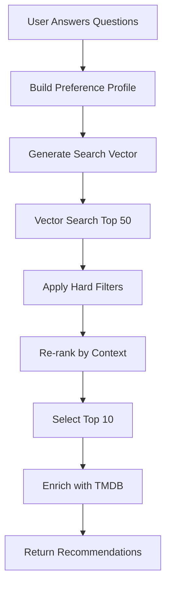

# 🧠 Vectorized Database Integration Brainstorm

## Current State Analysis

### What We Have Now
1. **Vectorize Worker**: 4,725 high-quality movies with:
   - OpenAI embeddings for semantic search
   - Rich metadata (genres, directors, keywords, ratings)
   - Quality scores from curator
   - Era distribution tracking

2. **WhatNext Worker**: 
   - Question-based preference discovery
   - Claude API for recommendations
   - Generic content recommendations (not movie-specific)
   - Information theory for question selection

## 🚀 NEW ARCHITECTURE VISION

### 1. Direct Database Integration
Instead of calling Claude for movie recommendations, directly query our vectorized database!

```javascript
// New endpoint in whatnext worker
router.post('/api/recommendations/movies', async (request, env) => {
  const { sessionId } = await request.json();
  const userState = await getUserState(sessionId);
  
  // Convert user preferences to search vector
  const searchVector = await convertPreferencesToVector(userState);
  
  // Query vectorize worker
  const recommendations = await fetch('https://vectorize.worker/search', {
    method: 'POST',
    body: JSON.stringify({
      vector: searchVector,
      filters: buildFilters(userState),
      limit: 10
    })
  });
  
  return recommendations;
});
```

### 2. Smart Preference-to-Vector Conversion

#### Option A: Question Embeddings
```javascript
// Each answer creates a text description
const preferenceText = buildPreferenceText(userState);
// "User wants intellectually challenging drama from the 1970s with 
//  a slow pace and artistic cinematography"

// Get embedding from OpenAI
const preferenceVector = await getEmbedding(preferenceText);

// Search for similar movies
const similar = await vectorSearch(preferenceVector);
```

#### Option B: Preference Profiles
```javascript
// Map user choices to movie characteristics
const profile = {
  genres: inferGenresFromChoices(userState),  // ['drama', 'thriller']
  eras: inferEraPreference(userState),         // ['1970-1989']
  mood: inferMoodFromChoices(userState),       // 'dark', 'thoughtful'
  pacing: inferPacingPreference(userState),    // 'slow', 'contemplative'
  complexity: getCognitiveLoad(userState)      // 'high'
};

// Build composite search
const results = await multiFactorSearch(profile);
```

### 3. Multi-Stage Recommendation Pipeline



### 4. New Endpoints Design

#### `/api/movies/recommend`
Primary recommendation endpoint using vectorized search
```javascript
{
  input: {
    sessionId: "uuid",
    preferences: {...},
    filters: {
      yearRange: [1970, 1990],
      minRating: 7.5,
      genres: ["drama", "thriller"],
      excludeWatched: ["movie_123", "movie_456"]
    }
  },
  output: {
    recommendations: [...],
    searchStrategy: "vector_similarity",
    confidence: 0.85
  }
}
```

#### `/api/movies/similar`
Find movies similar to one the user liked
```javascript
{
  input: {
    movieId: "movie_238",  // The Godfather
    limit: 10,
    diversityFactor: 0.3  // How different should results be
  },
  output: {
    similar: [...],
    commonThemes: ["crime", "family", "power"]
  }
}
```

#### `/api/movies/explore`
Exploration mode - find movies user wouldn't normally choose
```javascript
{
  input: {
    sessionId: "uuid",
    explorationLevel: "moderate",  // conservative, moderate, adventurous
    avoidGenres: ["horror"]
  },
  output: {
    discoveries: [...],
    explorationReason: "Based on your love of drama, try these comedies with dramatic elements"
  }
}
```

#### `/api/movies/mood`
Mood-based recommendations
```javascript
{
  input: {
    mood: "nostalgic",  // exciting, thoughtful, comforting, etc.
    timeAvailable: 120,  // minutes
    energyLevel: "low"
  },
  output: {
    moodMatches: [...]
  }
}
```

### 5. Smart Filtering System

```javascript
class SmartMovieFilter {
  constructor(userState, vectorDB) {
    this.userState = userState;
    this.db = vectorDB;
  }
  
  async buildFilters() {
    const filters = {};
    
    // Time-based filtering
    if (userState.timeCommitment === 'quick') {
      filters.runtime = { max: 100 };
    } else if (userState.timeCommitment === 'substantial') {
      filters.runtime = { min: 120 };
    }
    
    // Cognitive load filtering
    if (userState.cognitiveLoad === 'low') {
      filters.genres = { exclude: ['documentary', 'mystery'] };
      filters.vote_average = { min: 6.5, max: 8.5 }; // Not too artsy
    } else {
      filters.vote_average = { min: 7.5 }; // High quality only
    }
    
    // Era preferences
    if (userState.noveltyPreference === 'familiar') {
      filters.year = { min: 1990, max: 2010 }; // Familiar era
    } else if (userState.noveltyPreference === 'surprise') {
      filters.year = { max: 1980 }; // Classic discoveries
    }
    
    // Social context
    if (userState.socialContext === 'social') {
      filters.popularity = { min: 50 }; // Well-known for discussion
    }
    
    return filters;
  }
}
```

### 6. Learning & Personalization

```javascript
// Store user feedback in D1
CREATE TABLE user_preferences (
  user_id TEXT,
  movie_id TEXT,
  action TEXT, -- 'liked', 'disliked', 'watched', 'saved'
  context JSON,
  timestamp INTEGER
);

// Learn from feedback
async function updateUserProfile(userId, feedback) {
  // Get all user interactions
  const history = await getUserHistory(userId);
  
  // Find patterns
  const patterns = {
    likedGenres: extractGenrePreferences(history),
    preferredEras: extractEraPreferences(history),
    directorAffinity: extractDirectorPreferences(history),
    averageRating: calculatePreferredRating(history)
  };
  
  // Store learned preferences
  await storeUserProfile(userId, patterns);
}
```

### 7. Hybrid Recommendation Strategies

```javascript
class HybridRecommender {
  async getRecommendations(userState) {
    // 1. Vector similarity search (40% weight)
    const vectorResults = await this.vectorSearch(userState);
    
    // 2. Collaborative filtering (20% weight)
    const collaborative = await this.collaborativeFilter(userState);
    
    // 3. Content-based filtering (20% weight)
    const contentBased = await this.contentBasedFilter(userState);
    
    // 4. Trending/Popular (10% weight)
    const trending = await this.getTrending();
    
    // 5. Random exploration (10% weight)
    const exploration = await this.getRandomGems();
    
    // Merge and re-rank
    return this.mergeAndRank([
      { results: vectorResults, weight: 0.4 },
      { results: collaborative, weight: 0.2 },
      { results: contentBased, weight: 0.2 },
      { results: trending, weight: 0.1 },
      { results: exploration, weight: 0.1 }
    ]);
  }
}
```

### 8. Context-Aware Recommendations

```javascript
class ContextAwareRecommender {
  async recommend(userState, context) {
    const { timeOfDay, dayOfWeek, season, weather, device } = context;
    
    let filters = {};
    
    // Time of day adjustments
    if (timeOfDay === 'late_night') {
      filters.genres = { prefer: ['thriller', 'horror', 'mystery'] };
      filters.runtime = { max: 120 }; // Not too long for late night
    } else if (timeOfDay === 'sunday_afternoon') {
      filters.genres = { prefer: ['family', 'adventure', 'comedy'] };
    }
    
    // Seasonal adjustments
    if (season === 'december') {
      filters.keywords = { boost: ['christmas', 'holiday', 'family'] };
    } else if (season === 'october') {
      filters.genres = { boost: ['horror', 'thriller'] };
    }
    
    // Weather-based (if available)
    if (weather === 'rainy') {
      filters.mood = { prefer: ['cozy', 'dramatic', 'noir'] };
    }
    
    return await this.searchWithFilters(filters);
  }
}
```

### 9. Advanced Features

#### Recommendation Explanations
```javascript
// Instead of just returning movies, explain WHY
{
  movie: "Blade Runner",
  explanation: {
    primary: "Matches your preference for thought-provoking sci-fi",
    secondary: "Similar to 'The Matrix' which you enjoyed",
    confidence: 0.92,
    matchingFactors: [
      "dystopian themes",
      "philosophical questions",
      "neo-noir aesthetics"
    ]
  }
}
```

#### Group Recommendations
```javascript
// Find movies for multiple people
async function getGroupRecommendations(sessionIds) {
  const profiles = await Promise.all(
    sessionIds.map(id => getUserProfile(id))
  );
  
  // Find intersection of preferences
  const commonGround = findCommonPreferences(profiles);
  
  // Search for movies that satisfy all
  return await searchWithGroupConstraints(commonGround);
}
```

#### Discovery Paths
```javascript
// Create a journey through movies
async function createDiscoveryPath(startMovie, endGoal, steps = 5) {
  // E.g., from "Star Wars" to "2001: A Space Odyssey"
  // Creates a path of movies that gradually shift style/theme
  
  const path = [];
  let current = startMovie;
  
  for (let i = 0; i < steps; i++) {
    const next = await findBridgeMovie(current, endGoal, i / steps);
    path.push(next);
    current = next;
  }
  
  return path;
}
```

### 10. Performance Optimizations

#### Pre-computed Similarity Matrix
```javascript
// Batch compute similarities during off-peak
async function precomputeSimilarities() {
  const movies = await getAllMovies();
  
  for (const movie of movies) {
    const similar = await findSimilar(movie.vector_id, 20);
    await cacheSimilarities(movie.id, similar);
  }
}
```

#### Smart Caching
```javascript
// Cache based on preference profiles
const cacheKey = generateCacheKey({
  genres: userState.genres.sort().join(','),
  era: userState.era,
  cognitive: userState.cognitiveLoad
});

// Check if we have recent results for this profile
const cached = await getCache(cacheKey);
```

## Implementation Priority

1. **Phase 1: Basic Integration** (Week 1)
   - Create service to call vectorize worker
   - Convert user preferences to search parameters
   - Basic filtering by genre, year, rating

2. **Phase 2: Smart Search** (Week 2)
   - Implement preference-to-vector conversion
   - Add semantic search capabilities
   - Multi-factor filtering

3. **Phase 3: Learning & Personalization** (Week 3)
   - User history tracking
   - Feedback collection
   - Preference learning

4. **Phase 4: Advanced Features** (Week 4)
   - Context-aware recommendations
   - Group recommendations
   - Discovery paths

## Benefits of This Approach

1. **No More Generic Recommendations**: Actual movies from our curated database
2. **Instant Results**: No Claude API latency
3. **Better Control**: We control the entire recommendation logic
4. **Learning Capability**: Can improve based on user feedback
5. **Cost Effective**: No per-request API costs
6. **Richer Metadata**: Can filter by director, keywords, specific themes
7. **Quality Guaranteed**: Only recommending from our curated 4,725 movies

## Next Steps

1. Create a `VectorSearchService` in whatnext worker
2. Design the preference-to-vector mapping
3. Implement basic movie recommendation endpoint
4. Add filtering capabilities
5. Test with real user sessions
6. Iterate based on results

This is a complete reimagining of the recommendation system, leveraging our fantastic vectorized database!